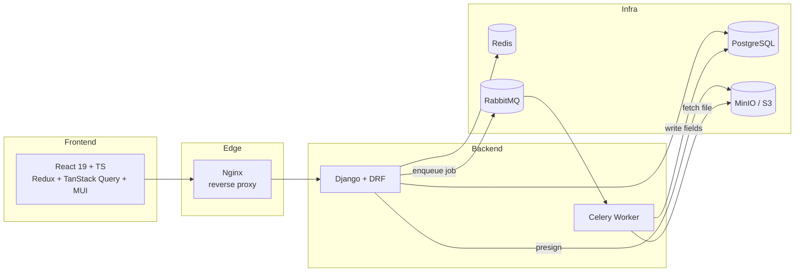

# DocuFlow

**An AI-assisted enterprise document-workflow platform.** Upload a document, an
async pipeline extracts structured fields with confidence scores, a human
reviewer accepts/edits/rejects them, and the application advances through a
role-guarded approval workflow — with every step enforced server-side.

Built around a single vertical slice, done deeply:

```
Upload → queued to RabbitMQ → Celery worker extracts fields + confidence
       → reviewer accepts / edits / rejects → application advances → audit
```

> **Status:** MVP complete — the full upload → extract → review → submit loop
> runs end to end. Workflow engine, dashboard, and hardening are in progress
> (see the [roadmap](./docs/PROJECT_PLAN.md)).

---

## Tech stack

| Layer | Choice | Why |
|---|---|---|
| Frontend | React 19 · TypeScript · Vite | Type safety across the API boundary, fast dev loop |
| Client state | Redux Toolkit | Auth/session/UI — deliberately small |
| Server state | TanStack Query | Caching, polling, mutation → invalidation |
| UI | MUI | Accessible, enterprise-looking without bespoke design |
| API | Django · DRF | Serializers, permissions, viewsets — batteries included |
| Async | Celery · RabbitMQ | Queues, retries, backoff, dead-letter, idempotency |
| Database | PostgreSQL | JSONB for extracted fields, real transactions |
| Cache / results | Redis | Celery result backend, caching |
| Object storage | MinIO (S3 API) | Real S3 semantics locally, presigned URLs |
| AI | Pluggable extractor, mock default | Deterministic and free to run; swappable for a real model |
| Auth | JWT (access + refresh) + RBAC | SimpleJWT, roles enforced by DRF permission classes |
| Infra | Docker Compose · Nginx | One command runs the whole stack |

---

## Architecture



The API and the Celery worker share one image but run as separate processes, so
a slow extraction can't block HTTP requests, and each scales independently. The
browser only ever talks to one origin (Nginx), so there's no CORS in dev or
prod. Full data model, state machine, and sequence diagrams are in
[ARCHITECTURE.md](./docs/ARCHITECTURE.md).

### The extraction pipeline

Uploading a document enqueues an async job with production reliability built in:

- **Presigned uploads** — the browser uploads directly to object storage; the
  API never proxies file bytes.
- **Retries with exponential backoff**, then a **dead-letter** state so failed
  jobs surface instead of vanishing.
- **Idempotent** — retries and re-runs upsert fields on a `(document, key)`
  unique constraint, never duplicating.
- **Pluggable extractor** — the AI sits behind an interface. The default
  `MockExtractor` is deterministic (seeded from a hash of the file), needs no
  API keys, and runs in CI; a real OCR + LLM backend swaps in behind the same
  interface with no caller changes.

---

## Roles

Three roles, enforced by DRF permission classes — the frontend hides what a role
can't do, but the API is the real gate.

| Capability | Admin | Reviewer | Auditor |
|---|:--:|:--:|:--:|
| Create application / upload | ✓ | ✓ | — |
| Run extraction | ✓ | ✓ | — |
| Accept / edit / reject fields | ✓ | ✓ | — |
| Submit review | ✓ | ✓ | — |
| View applications & fields (read-only) | ✓ | ✓ | ✓ |

---

## Running locally

Requires Docker Desktop.

```bash
cp .env.example .env
docker compose up -d
docker compose exec backend python manage.py seed_users
```

Then open **http://localhost** and sign in with a seeded account:

| Role | Email | Password |
|---|---|---|
| Admin | `admin@docuflow.local` | `devpass123` |
| Reviewer | `reviewer@docuflow.local` | `devpass123` |
| Auditor | `auditor@docuflow.local` | `devpass123` |

Create an application, upload a PDF, watch it extract, then click **Review** to
accept/edit/reject the fields and submit.

<details>
<summary>Service endpoints & consoles</summary>

| Service | URL | Credentials |
|---|---|---|
| App (via Nginx) | http://localhost | — |
| API docs (Swagger) | http://localhost/api/docs | — |
| RabbitMQ management | http://localhost:15672 | `docuflow` / `docuflow` |
| MinIO console | http://localhost:9001 | `docuflow` / `docuflow123` |
| PostgreSQL | `localhost:5432` | `docuflow` / `docuflow` |
| Redis | `localhost:6379` | — |

</details>

---

## API overview

All under `/api/v1/`, documented via OpenAPI at `/api/docs`.

| Area | Endpoints |
|---|---|
| Auth | `POST /auth/register`, `/auth/login`, `/auth/refresh`, `/auth/logout`, `GET/PATCH /auth/me` |
| Applications | `GET/POST /applications`, `GET/PATCH /applications/{id}`, `POST /applications/{id}/submit_review` |
| Documents | `POST /applications/{id}/documents` (presign), `POST /documents/{id}/complete`, `GET /documents/{id}/file` |
| Extraction | `GET /jobs/{id}`, `GET /fields`, `PATCH /fields/{id}` |

---

## Project structure

```
backend/
  apps/
    core/          shared base models, permissions, storage, health
    users/         custom user model, JWT auth, RBAC
    applications/  Application resource + workflow transitions
    documents/     Document model, presigned upload flow
    extraction/    ExtractionJob/ExtractedField, Celery task, extractors
  config/          settings (base/dev/prod), celery, urls
frontend/
  src/
    app/           providers, store, layout, route guards
    features/      auth · applications · documents · review · health
    lib/           axios instance + JWT interceptors
docs/              architecture & roadmap
nginx/             reverse-proxy config
```

---

## Design decisions & trade-offs

- **JWT with refresh rotation.** 15-minute access tokens, rotating refresh
  tokens with blacklist-after-rotation. Tokens are stored in `localStorage`
  (simple, pairs with the axios refresh interceptor); an httpOnly-cookie
  refresh token is the documented hardening path.
- **Polling, not WebSockets.** The client polls job status only while work is
  in flight, then stops. Simpler than a socket lifecycle and sufficient at this
  scale; WebSockets/SSE would be the move for sub-second or high-fan-out updates.
- **Object storage over blobs-in-DB.** Presigned URLs keep large files off the
  app server; the database holds only metadata and a storage key.
- **Deliberately deferred:** live WebSocket updates, Elasticsearch (Postgres
  full-text instead), multi-tenant orgs, chunked upload + virus scanning. See
  [ARCHITECTURE.md §11](./docs/ARCHITECTURE.md).

---

## License

MIT — see [LICENSE](./LICENSE).
