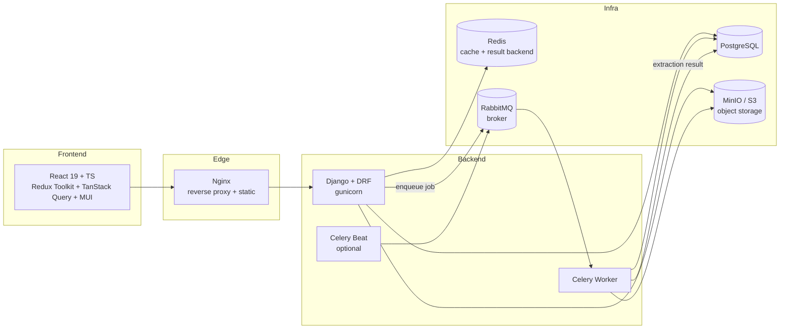
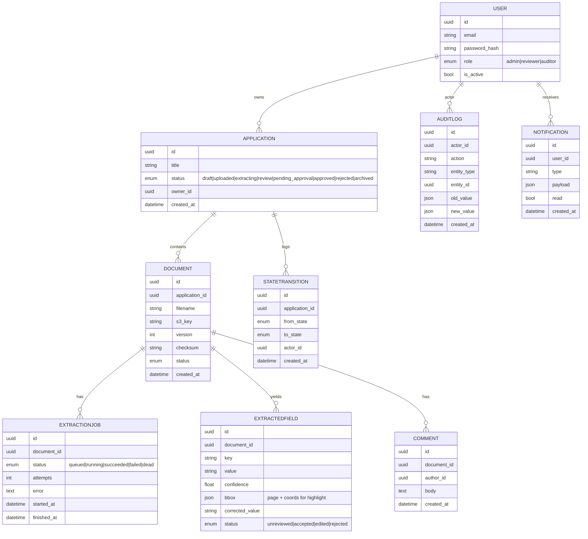
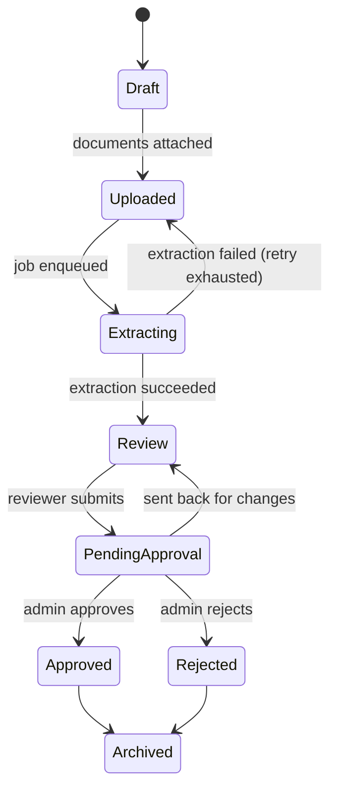
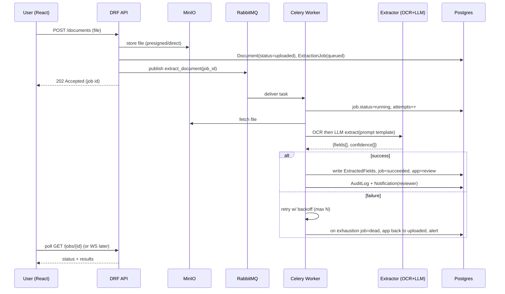

# DocuFlow — Architecture

> Working title: **DocuFlow** (rename freely). An AI-assisted enterprise document-workflow platform: upload → AI extraction → human review → approval → audit.

This document is the "what and why." The build order lives in [PROJECT_PLAN.md](./PROJECT_PLAN.md).

---

## 1. The one flow that defines the product

Everything is built around a single vertical slice, done deeply:

```
Upload document
   → queued to RabbitMQ
      → Celery worker: OCR (text + layout)
         → LLM extraction against a prompt template
            → structured JSON + per-field confidence score
               → reviewer sees the doc with fields highlighted, edits/accepts/rejects
                  → approval advances a workflow state machine
                     → every mutation written to an immutable audit log
```

If a feature doesn't serve that flow, it's backlog — not MVP.

---

## 2. System components



Every box in that diagram maps to a line on your resume, and every arrow is an interview question. That's the point of the design.

---

## 3. Tech stack & why

| Layer | Choice | Why (the interview answer) |
|---|---|---|
| Frontend | React 19 + TypeScript + Vite | Modern, fast dev loop, type safety across API boundary |
| Client state | Redux Toolkit | Auth/session/UI state; shows you know when *not* to use it |
| Server state | TanStack Query | Caching, background refetch, mutation invalidation — the right tool for API data |
| UI kit | MUI | Fast, accessible, enterprise-looking without design work |
| API | Django + DRF | Batteries-included; DRF serializers/permissions/viewsets are enterprise-standard |
| Async | Celery + RabbitMQ | The star of the show — queues, retries, dead-letter, idempotency |
| DB | PostgreSQL | JSONB for extracted fields, full-text search, real transactions |
| Cache/results | Redis | Celery result backend, rate limits, dashboard caching |
| Object store | MinIO (S3 API) | Real S3 semantics locally, presigned URLs |
| AI | Pluggable extractor (OCR + LLM), **mock mode default** | Runs free & deterministic; swap in Claude API + Tesseract for real |
| Auth | JWT (access + refresh) + RBAC | SimpleJWT; roles enforced via DRF permission classes |
| Infra | Docker Compose + Nginx | One `docker compose up` runs the whole thing |
| CI | GitHub Actions | Lint + test + build on every push |
| Tests | pytest + factory_boy · Jest + RTL + MSW | Backend and frontend both covered |

### The AI design decision that matters

The extractor is an **interface**, not a hardcoded call:

```
ExtractorBackend (abstract)
 ├── MockExtractor      # deterministic fixtures — default, no keys, no cost, CI-safe
 ├── TesseractOCR + LLM # real: pytesseract → Claude API with a prompt template
```

This is deliberately a talking point: "I isolated the AI behind an interface so the system is testable, runs in CI with no external calls, and the model is swappable." Confidence scores come from the LLM's structured output (or are simulated in mock mode).

---

## 4. Data model



Notes:
- **UUID PKs** everywhere (looks enterprise, avoids ID enumeration).
- `EXTRACTEDFIELD.bbox` (JSONB) drives the highlight overlay in the review UI.
- `AUDITLOG` is append-only — writes happen in the same DB transaction as the mutation, so the log can never drift from reality. Good story to tell.
- Workflow status lives on `APPLICATION`; **every** change also appends a `STATETRANSITION` row.

---

## 5. The workflow state machine



Transitions are validated server-side (you cannot jump states via the API). This is your "I implemented a proper state machine, not a status string people mutate freely" answer.

---

## 6. The extraction pipeline (the centerpiece)



Reliability details worth building (and talking about):
- **Retries with exponential backoff** and a max attempt count (`autoretry_for`, `retry_backoff`).
- **Dead-letter handling**: exhausted jobs go to `dead`, surface on the dashboard, don't silently vanish.
- **Idempotency**: re-running a job for the same document version is safe (upsert fields, don't duplicate).
- **Timeouts**: hard task time limit so a stuck LLM call can't hold a worker forever.

---

## 7. API surface (v1)

All under `/api/v1/`, documented via OpenAPI (drf-spectacular → Swagger UI).

| Area | Endpoints |
|---|---|
| Auth | `POST /auth/register`, `/auth/login`, `/auth/refresh`, `/auth/me` |
| Applications | `GET/POST /applications`, `GET/PATCH /applications/{id}`, `POST /applications/{id}/transition` |
| Documents | `POST /applications/{id}/documents`, `GET /documents/{id}`, `GET /documents/{id}/file` (presigned) |
| Extraction | `GET /jobs/{id}`, `POST /documents/{id}/reextract` |
| Review | `GET /documents/{id}/fields`, `PATCH /fields/{id}` (accept/edit/reject) |
| Comments | `GET/POST /documents/{id}/comments` |
| Audit | `GET /audit` (auditor/admin; filter by entity, actor, date) |
| Dashboard | `GET /dashboard/metrics` |
| Admin | `GET/POST /admin/users`, `PATCH /admin/users/{id}` |

Cross-cutting: pagination (page-number), filtering (django-filter), ordering, and consistent error envelopes.

---

## 8. RBAC

Three roles, enforced by DRF permission classes (not frontend-only):

| Capability | Admin | Reviewer | Auditor |
|---|:--:|:--:|:--:|
| Upload / create application | ✓ | ✓ | — |
| Run/re-run extraction | ✓ | ✓ | — |
| Edit/accept/reject fields | ✓ | ✓ | — |
| Approve / reject application | ✓ | — | — |
| Manage users | ✓ | — | — |
| View audit log | ✓ | — | ✓ |
| View dashboard | ✓ | ✓ | ✓ |

The frontend hides what a role can't do; the API is the real gate. Say exactly that in interviews.

---

## 9. Frontend architecture

- **Redux Toolkit** → auth/session, current user, global UI (toasts, modals, theme). Small, deliberate.
- **TanStack Query** → all server data (applications, documents, fields, dashboard). Handles caching, polling the job status, and mutation → invalidation.
- **Routing** → React Router, route guards by role.
- **Review screen** → PDF/image viewer with an absolutely-positioned highlight overlay driven by `bbox`; a side panel lists fields with confidence badges (green/amber/red) and accept/edit/reject controls.
- **Feature-folder structure**: `features/auth`, `features/documents`, `features/review`, `features/dashboard`, `features/admin` — each with its components, hooks, and API layer.

---

## 10. Observability & ops (kept lean for MVP)

- **Structured JSON logging** with a request/correlation id threaded API → worker.
- **Health checks**: `/healthz` (liveness) and `/readyz` (DB/broker/redis reachable).
- Prometheus/Grafana are **explicitly deferred** — documented as "how I'd add metrics," built only if time remains. Don't let them eat the schedule.

---

## 11. What is deliberately NOT in the MVP

Cut on purpose (keep as a documented backlog — this list is itself an interview asset):

Module Federation · Slack/webhook fan-out beyond one webhook · Elasticsearch (use Postgres full-text) · Prometheus/Grafana dashboards · Jenkins (GitHub Actions only) · chunked upload + virus scan · WebSocket live updates (poll first) · multi-tenant orgs.

Each is a clean "here's how I'd extend it" answer without the build cost.
